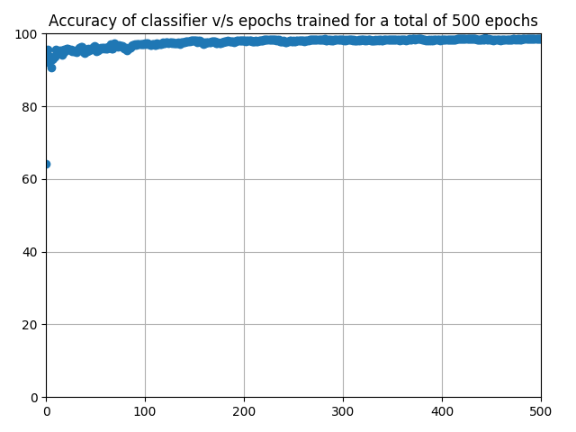
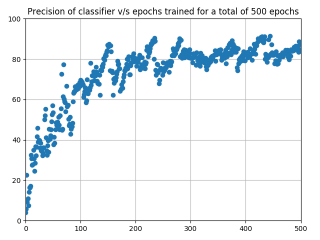
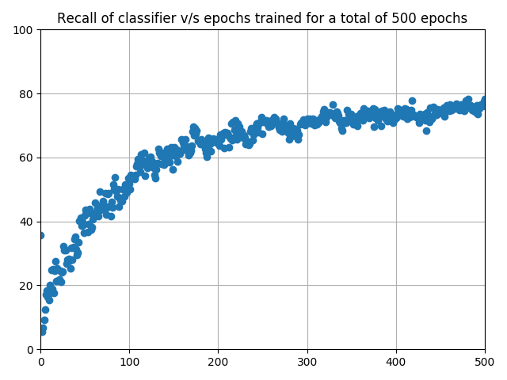
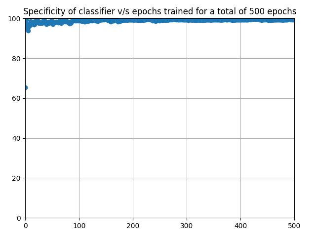
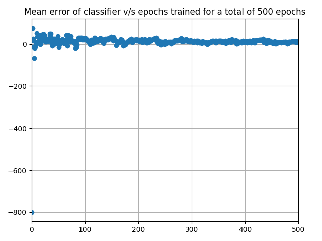
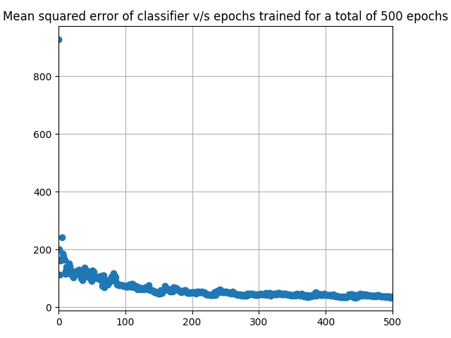

# cc5114-examples
---

Examples of the concepts from the course CC5114: Neural Networks 
and Genetic Programming

Copy hosted over at [my Github page (Collaborators only)](https://github.com/Gedoix/cc5114-examples.git)

Packages are described here in the order they were developed, and explaining 
what they do

## Description of the Packages
---

### basic_perceptrons

This package contains basic implementations of perceptrons and 
networks made from them, along with a more specific collection of 
single perceptron logic gates and a bit adder network of nand gates

`basic_perceptrons.py` contains a perceptron implementation and 
all logic gate implementations, including some extra methods for 
use outside the package

`basic_networks.py` contains a basic yet extensible network 
implementation as well as the addition network

### learning_perceptrons

This package contains a basic implementation of a learning linear 
classifier re-using the perceptron implementation from `basic_perceptrons.py`

`basic_classifier.py` contains an implementation of a linear classifier that 
auto-trains if necessary

The file can be executed, in which case it will print example plots that prove 
that it can learn

### sigmoid_perceptrons

This package implements sigmoid perceptrons and a classifier that uses them, 
reusing some code from the two previous packages

`sigmoid_perceptrons.py` contains an implementation of both the sigmoid 
perceptron and a classifier using it

The file can be executed, in which case it will print example plots that prove 
that it can learn

`logic_gate_training.py` contains a plotted test for checking if the sigmoid 
perceptron can simulate the `and`, `or`, `nand` and `xor` logic gates through 
learning the correct parameters

Learning `xor` using a single perceptron is impossible, so the accuracy of 
that simulation in particular can never arrive at 100%, but the other gates 
can all be learned

### sigmoid_networks

This package contains an implementation from scratch of an extensible and 
trainable neural network, using sigmoid perceptrons, to be used for 
classification problems in large datasets.

`network.py` is an executable file, which generates plots to prove it can 
actually learn a simple linear classification problem with many neurons 
and also what sort of results and consistency to expect from it.

### dataset_predictor

This package contains a single executable file, configured to read a `.csv` 
like dataset, in this case `letter-recognition.data`, and use the contents of 
the `sigmoid_networks` package to train a complex network to predict with good 
accuracy the value of one of the dataset's attributes from the rest of it's 
attributes.

The file, `network_prediction.py`, then produces 6 plots showing the 
improvement over times trained of the network's classification algorithm 
through the use of 6 different metrics classification metrics.

## Getting Started
---

These instructions will get you a copy of the project up and running on your 
local machine for development and testing purposes.

### Prerequisites

This repo's project was and is being developed using [Python 3.7](https://www.python.org/downloads/), together 
with the packages [numpy](http://www.numpy.org/), 
[matplotlib](https://matplotlib.org/) and [tqdm](https://github.com/tqdm/tqdm).

All of this was put together easily through [Jetbrain's](https://www.jetbrains.com/)
IDE for Python, [PyCharm](https://www.jetbrains.com/pycharm/)

It is recommended that this same IDE is used for testing and evaluating the 
project, the explanations on how to run it will not include any other 
environments.

It will also be assumed that the reader's OS of choice is a Linux Debian distro 

### Installing

The easiest ways to install all of these dependencies is as follows:

* Getting a copy of [Jetbrain's Toolbox](https://www.jetbrains.com/products.html?fromMenu#) 
and installing it, once the tool is running it should allow installing either 
Pycharm Community Edition or the Professional Edition, either one is useful

* Getting [git](https://git-scm.com/) installed in the machine, this will 
allow Jetbrain's tools to recognize it's presence automatically, and 
facilitate project version control

* Cloning the repository from [my Github page (Collaborators only)](https://github.com/Gedoix/cc5114-examples.git)
using the IDE's facilitation tools for Version Control Importing. Make sure to
specify that the project was developed in PyCharm and not any other IDE through
the import's UI

* Once the repo has been cloned, installing Python 3.7 is easy following [this](http://unix.stackexchange.com/questions/110014/ddg#110163) 
tutorial

* After all the already mentioned is installed, the project needs to be opened,
 so PyCharm can configure the interpreter to Python 3.7
 
* Accessing the project settings inside the toolbar, going into the 
`interpreter` tab, and clicking on the plus `add package` button will allow to 
easily install [numpy](http://www.numpy.org/), 
[matplotlib](https://matplotlib.org/) and [tqdm](https://github.com/tqdm/tqdm),
just by searching them by name.

* After this the projects imports should all be working. Time to test it out!

## Running the tests

To run the automated unit tests all that needs to be done is 
to right-click the `test` directory and select the `Run 'Unittest in test' 
with Coverage` option, a coverage suite should open along with a console 
stating `Tests passed: 22 of 22 tests`.

This automated tests only offer basic coverage of some of the more advanced 
methods in the project, to run some of the more lengthy (and time consuming) 
tests all that's needed is to right-click the Python executable files 
containing them and click `Run 'file_to_execute.py'`. The files that can be 
run are:

* `learning_perceptrons.basic_classifier.py`

* `sigmoid_perceptrons.sigmoid_perceptrons.py`

* `sigmoid_perceptrons.logic_gate_training.py`

* `sigmoid_networks.network.py`

* `dataset_predictor.network_prediction.py`

All of these files can generate plots and printed proof of the workings
of the code being tested

## Further Information on dataset_predictor.network_prediction.py

The file first loads all data in the dataset `letter-recognition.data`,
which can be found [here](https://archive.ics.uci.edu/ml/datasets/Letter+Recognition)

This dataset contains a total of 20000 instances each with 16 attributes 
generated from a set of distorted fonts, these attributes count features of 
said fonts such as `y-edge mean edge count bottom to top`.

An extra column was added to the data containing the classification of the 
instance, therefore the letter that the classifier should be able to recognize

It has no missing values, and all attributes except for the classification are
integers

Before starting the prediction process the classification expected results are
converted to binary vectors, where the i-th dimension of the vector is a 1 if 
and only if the instance is classified into the i-th letter of the alphabet

The attributes were also normalized after finding their max and min values

After this a randomized partition of the data is extracted for testing 
purposes later

Then the classifier network is built with a total of 4 hidden layers and 
90 perceptrons

The training partition of the data is then used as a training epoch and the 
network trains for 500 epochs, producing the following outputs:

After some testing it can also be observed that the amount of hidden layers 
greatly increases the training time for each epoch, while sometimes barely 
affecting the accuracy.

In general the time per training epoch for my pc was of 22-23 seconds, around
3 hours and 12 minutes for a total of 500 epochs, this greatly harms the 
chances of doing a quick and through analysis of the algorithm without 
reducing the amount of epochs a lot.

Different learning rates change the rate of learning, but a learning rate too 
big can sporadically spiral out of control, making the training possibly 
unstable.

Shuffling the training examples can produce very different learning speeds and
results for a small number of epochs, meaning that this is possibly a trend 
for even larger training sessions

## Built With

* [PyCharm](https://www.jetbrains.com/pycharm/) - IDE used for Python
* [git](https://git-scm.com/) - Version Control system
* [NumPy](http://www.numpy.org/) - Scientific numeric computation package
* [MatPlotLib](https://matplotlib.org/) - Plotting package
* [tqdm](https://github.com/tqdm/tqdm) - Loading bar printer and manager
* [README.md Template](https://gist.github.com/PurpleBooth/109311bb0361f32d87a2) - Template for good practices when writing a README

## Versioning

I used [GitHub](http://github.com/) for versioning.

## Authors

* **Diego Ortego** - *All Package Implementations* - [Gedoix](https://github.com/Gedoix)

## Acknowledgments

* Hat tip to anyone whose code was used
* Universidad de Chile's CC5114 course
